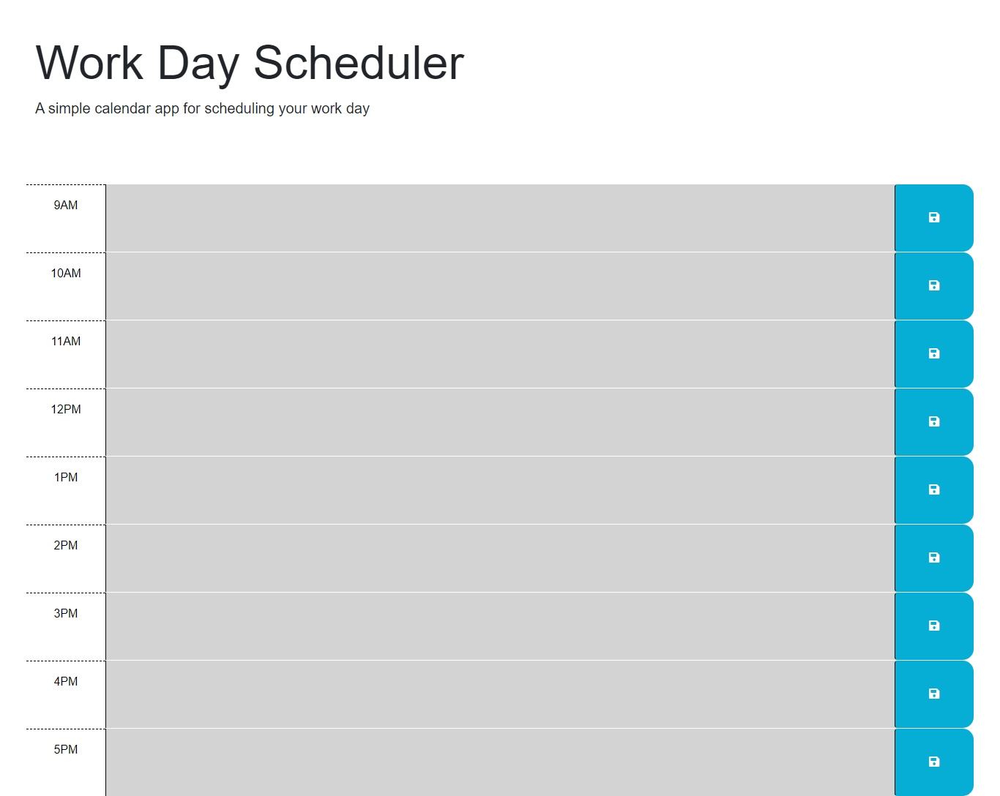

# Work Day Scheduler Starter Code

## Description

-This application will help organize a user's work day.

-The color classes will make it more clear what else needs to be done throughout the day.

-The save button will allow the user to save consistent tasks to be done throughout the week.

## Usage

Type in a task in a time block. 
The save button will save the task(s) in user storage. 
Gray will represent time that has already past.
Red will represent the current time block.
Green will represent tasks that have not been done yet.

Link to application:
[https://billyg04t.github.io/mod-challenge-5/]

## Credits

ChatGPT was used for the codeTextData function as well as semantics throughout the JavaScript file.

day.js ibrary was implemented to add functionality and format to the planner.

Bootstrap library was used in the styling of the application.

Modules 5 and 6 of the Vanderbilt University Full Stack Web Development Program were referenced throughout the JavaScript file.

The starter code was provided by crispy-octo-meme [https://github.com/coding-boot-camp/crispy-octo-meme]

## License

MIT License

Copyright (c) 2023 billyg04t

Permission is hereby granted, free of charge, to any person obtaining a copy
of this software and associated documentation files (the "Software"), to deal
in the Software without restriction, including without limitation the rights
to use, copy, modify, merge, publish, distribute, sublicense, and/or sell
copies of the Software, and to permit persons to whom the Software is
furnished to do so, subject to the following conditions:

The above copyright notice and this permission notice shall be included in all
copies or substantial portions of the Software.

THE SOFTWARE IS PROVIDED "AS IS", WITHOUT WARRANTY OF ANY KIND, EXPRESS OR
IMPLIED, INCLUDING BUT NOT LIMITED TO THE WARRANTIES OF MERCHANTABILITY,
FITNESS FOR A PARTICULAR PURPOSE AND NONINFRINGEMENT. IN NO EVENT SHALL THE
AUTHORS OR COPYRIGHT HOLDERS BE LIABLE FOR ANY CLAIM, DAMAGES OR OTHER
LIABILITY, WHETHER IN AN ACTION OF CONTRACT, TORT OR OTHERWISE, ARISING FROM,
OUT OF OR IN CONNECTION WITH THE SOFTWARE OR THE USE OR OTHER DEALINGS IN THE
SOFTWARE.